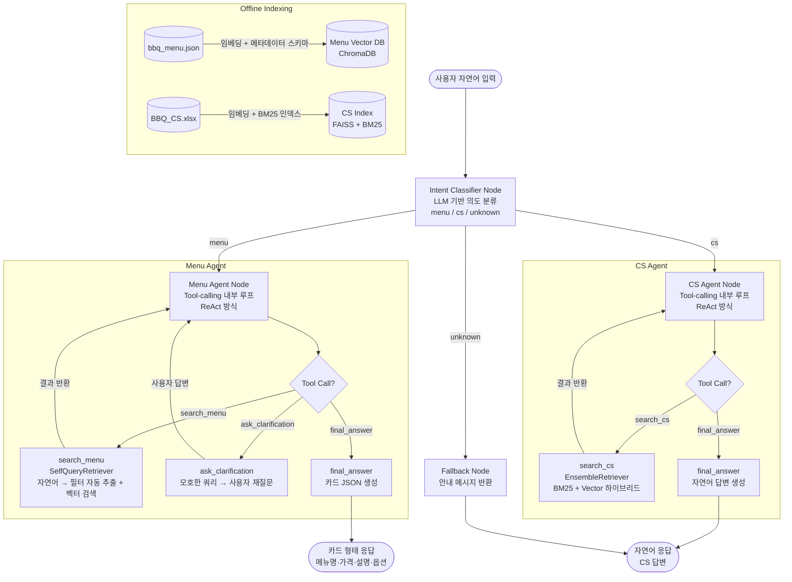

# BBQ Menu & CS Agent

## 배경
- **Menu Agent**: 사용자가 BBQ 앱에서 주문 시 원하는 메뉴를 직접 검색해야 하는 불편함 해소.
  추상적인 기억("매운 치킨 같은 거")을 자연어로 입력하면 최적의 메뉴를 추천.
- **CS Agent**: 주문 전/중/후 발생하는 고객 문의(배달 지연, 환불, 메뉴 문의 등)에 자동 응답.

---

## 기술 스택

| 역할 | 도구 |
|---|---|
| 언어 | Python 3.11+ |
| Agent Orchestration | LangGraph (StateGraph + cycle) |
| LLM | GPT-4o-mini (OpenAI API) |
| Embedding | text-embedding-3-large (OpenAI) |
| Vector DB (메뉴) | ChromaDB (SelfQueryRetriever 호환) |
| Vector DB (CS) | FAISS (EnsembleRetriever 호환) |
| Tool-calling | LangChain Tool + OpenAI Function Calling |
| API 서버 | FastAPI |
| 데이터 처리 | Pandas, openpyxl |
| 환경 변수 | python-dotenv |

---

## 시스템 아키텍처



---

## 설계 원칙: LangGraph 구조 + 내부 Tool-calling

**LangGraph (그래프 레벨)**: 큰 흐름 제어 — Intent 분류 후 도메인별 Node로 라우팅, State 관리
**Tool-calling (Node 레벨)**: 각 도메인 내부에서 LLM이 자율적으로 Tool 선택 및 ReAct 루프 실행

```
[LangGraph] Intent Classifier → conditional edge → Menu Agent Node
                                                 → CS Agent Node
                    ↑ Graph 레벨 (결정론적 라우팅)

[각 Node 내부] Tool-calling ReAct 루프
  Thought → Action(Tool) → Observe → Thought → ... → final_answer
                    ↑ Node 레벨 (LLM 자율 판단)
```

단순 파이프라인(`입력 → 검색 → 출력`)이 아닌, LLM이 **스스로 판단하고 도구를 선택**하는 구조.

```
[Thought]  사용자가 "혼자 먹기 좋은 저렴한 거" 라고 했는데, 1인분인지 모호함
[Action]   ask_clarification("혼자 드시는 건가요? 인원수를 알려주시면 더 잘 추천해드릴게요")
[Observe]  "응 나 혼자"
[Thought]  1인 + 저렴한 조건. 가격 기준이 모호하니 search_menu로 저렴한 1인 메뉴 검색
[Action]   search_menu(query="1인 저렴한 메뉴", filters={price: {lte: 15000}})
[Observe]  [검색 결과 3개]
[Thought]  결과가 충분함. 카드 형태로 응답
[Action]   final_answer(type="menu_cards", items=[...])
```

---

## Tool 목록

### Menu Agent Tools
| Tool | 역할 | 내부 구현 |
|---|---|---|
| `search_menu` | 메뉴 검색 (자연어 필터 포함) | SelfQueryRetriever + ChromaDB |
| `ask_clarification` | 모호한 쿼리 → 사용자 재질문 | LLM 응답 후 대기 |
| `final_answer` | 카드 JSON 생성 | 메뉴 카드 포맷팅 |

### CS Agent Tools
| Tool | 역할 | 내부 구현 |
|---|---|---|
| `search_cs` | CS Q&A 검색 | EnsembleRetriever (BM25 + FAISS) |
| `final_answer` | 자연어 답변 생성 | RAG 기반 LLM 응답 |

---

## 과정 상세

### 0. 오프라인 인덱싱 (사전 작업)

**메뉴 인덱싱 → ChromaDB**

1. `Data/bbq_menu.json` 로드

2. 필드별 처리 방식 분리:

| 필드 | 처리 방식 | 이유 |
|---|---|---|
| 메뉴명 | **임베딩 텍스트** | 의미론적 검색 핵심 |
| 구분 (카테고리) | **임베딩 텍스트 + 메타데이터** | 검색 및 필터링 모두 사용 |
| 설명 | **임베딩 텍스트** | "매운 거", "담백한 거" 같은 추상 쿼리 대응 |
| 알레르기 정보 | **임베딩 텍스트 + 메타데이터** | 자연어 쿼리 및 제외 필터링 모두 필요 |
| 가격 | **메타데이터만** | 숫자 범위 필터 (`price <= 20000`) |
| 원산지 | **메타데이터만** | 의미론적 검색과 무관 |
| 영양 정보 | **메타데이터만** | 구조화된 숫자 데이터 |
| 구매 옵션 | **메타데이터만** | 복잡한 JSON, 검색 후 후처리로 매핑 |

3. 임베딩 텍스트 포맷:
   ```
   "뿜치킹 | 신메뉴 | 매콤하고 바삭한 순살 치킨, 특제 뿜뿜 소스 | 알레르기: 밀, 대두, 닭고기"
   ```

4. SelfQueryRetriever용 메타데이터 스키마 (`AttributeInfo`):
   ```python
   metadata_field_info = [
       AttributeInfo(name="price",    description="메뉴 가격 (원)", type="integer"),
       AttributeInfo(name="category", description="메뉴 카테고리 (예: 신메뉴, 사이드)", type="string"),
       AttributeInfo(name="allergy",  description="알레르기 유발 성분 목록", type="string"),
   ]
   ```

5. `text-embedding-3-large`로 벡터 변환 → ChromaDB 저장

---

**CS 인덱싱 → FAISS + BM25**

1. `Data/BBQ_CS.xlsx` 로드 (Q&A 쌍 형태)
2. 질문 + 답변을 하나의 Document로 청킹
3. FAISS 벡터 인덱스 + BM25Retriever 각각 구축

---

### 1. 사용자 자연어 입력
- FastAPI `/chat` 엔드포인트로 `user_input` + `session_id` 수신
- LangGraph 그래프 실행 시작

---

### 2. Intent Classifier Node (LangGraph 레벨)
- **역할**: 사용자 입력의 의도를 분류 → conditional edge로 라우팅
- **방법**: LLM 프롬프트 → `menu` / `cs` / `unknown` 반환
- **출력**: `State.intent` → LangGraph가 다음 Node 결정

---

### 3-A. Menu Agent Node (Tool-calling 내부 루프)
- **역할**: 메뉴 추천 전담, `final_answer` 호출까지 ReAct 루프 (최대 5회)
- **입력**: `State.messages`
- LLM이 Tool 선택 → 실행 → 결과 관찰 → 반복

**search_menu Tool**
- SelfQueryRetriever가 자연어에서 가격·카테고리·알레르기 필터 자동 추출
- ChromaDB에서 top-k 검색 → 결과를 messages에 추가

**ask_clarification Tool**
- 쿼리가 모호할 때 LLM이 자율 판단으로 호출
- 사용자 답변 수신 후 루프 재개

**final_answer Tool (menu)**
- 검색 결과 → 카드 JSON 포맷 생성

---

### 3-B. CS Agent Node (Tool-calling 내부 루프)
- **역할**: CS 문의 전담, `final_answer` 호출까지 ReAct 루프

**search_cs Tool**
- EnsembleRetriever (BM25 40% + Vector 60%)로 유사 Q&A 검색
- top-3 결과 → messages에 추가

**final_answer Tool (cs)**
- Retrieved Q&A + 쿼리 → LLM → 자연어 답변 생성

---

### 4. 응답 반환

```json
// 메뉴 추천 응답
{
  "type": "menu_cards",
  "items": [
    {
      "name": "뿜치킹",
      "category": "신메뉴",
      "price": 25000,
      "description": "...",
      "allergy": "...",
      "nutrition": { "kcal": 850 },
      "options": [...]
    }
  ]
}

// CS 응답
{
  "type": "text",
  "message": "환불은 수령 후 1시간 이내에 고객센터(1588-xxxx)로 연락 주시면 처리 가능합니다."
}
```

---

## LangGraph State 정의

```python
from typing import TypedDict, List, Optional
from langchain_core.messages import BaseMessage

class AgentState(TypedDict):
    messages: List[BaseMessage]   # 전체 대화 이력 (Human + AI + Tool)
    intent: Optional[str]         # "menu" | "cs" | "unknown" — Intent Classifier Node 결과
    response: dict                # 최종 응답 (카드 JSON 또는 텍스트)
```

---

## 프로젝트 디렉토리 구조

```
bbq project/
├── .env                          # OPENAI_API_KEY 등
├── main.py                       # FastAPI 엔트리포인트
├── graph/
│   ├── __init__.py
│   ├── state.py                  # AgentState 정의
│   └── graph.py                  # LangGraph StateGraph (ReAct loop)
├── tools/
│   ├── __init__.py
│   ├── search_menu.py            # SelfQueryRetriever 기반 메뉴 검색
│   ├── search_cs.py              # EnsembleRetriever 기반 CS 검색
│   ├── ask_clarification.py      # 재질문 Tool
│   └── final_answer.py           # 응답 포맷팅 Tool
├── vectorstore/
│   ├── build_menu_index.py       # 메뉴 ChromaDB 인덱싱 스크립트
│   ├── build_cs_index.py         # CS FAISS + BM25 인덱싱 스크립트
│   └── chroma_db/                # ChromaDB 저장 디렉토리
├── Data/
│   ├── bbq_menu.json
│   ├── bbq_menu.csv
│   └── BBQ_CS.xlsx
└── requirements.txt
```

---

## 답변 형태

| 의도 | 응답 형태 |
|---|---|
| 메뉴 추천 (menu) | 카드 JSON (프론트엔드에서 카드 UI 렌더링) |
| CS 문의 (cs) | 자연어 텍스트 |
| 모호한 쿼리 | 재질문 후 대기 |
