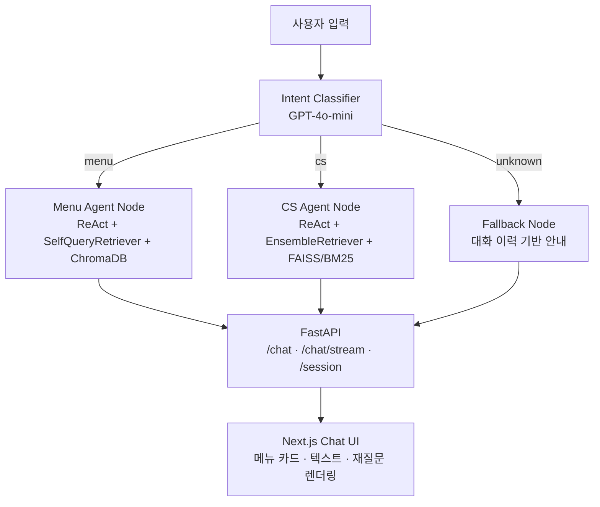

# BBQ Menu & CS Agent

> LangGraph 기반 멀티 에이전트 시스템 — 자연어로 BBQ 메뉴를 추천하고 고객 문의에 자동 응답합니다.

---

## 프로젝트 개요

추상적인 자연어 입력("매운 치킨 같은 거", "환불하고 싶어요")을 이해하고, **Intent를 자동 분류**한 뒤 적합한 전문 에이전트가 응답하는 LLM 기반 대화 시스템입니다.

- **Menu Agent** — 가격·카테고리·식감·맵기 필터를 자연어에서 자동 추출해 ChromaDB로 메뉴 검색
- **CS Agent** — BM25 + FAISS 하이브리드 검색으로 고객 문의에 맞는 응대 사례를 찾아 자동 답변
- **FastAPI 백엔드 + Next.js 프론트엔드** — 스트리밍(SSE) 응답 지원 풀스택 구성

---

## 시스템 아키텍처



**LangGraph StateGraph**가 큰 흐름(Intent 분류 → 도메인 라우팅)을 담당하고, 각 Node 내부는 `create_react_agent`의 **ReAct 루프**가 Tool 선택을 자율적으로 처리합니다.

```
[Thought]  "혼자 먹기 좋은 저렴한 거" → 1인 저렴한 메뉴
[Action]   search_menu(query="1인 저렴한 메뉴")
[Observe]  검색 결과 3개
[Answer]   메뉴 카드 JSON 반환
```

---

## 기술 스택

| 영역 | 기술 |
|---|---|
| 언어 | Python 3.11+ / TypeScript |
| Agent Orchestration | LangGraph (StateGraph, create_react_agent) |
| LLM | GPT-4o-mini (OpenAI) |
| Embedding | text-embedding-3-large (OpenAI) |
| Vector DB (메뉴) | ChromaDB + SelfQueryRetriever |
| Vector DB (CS) | FAISS + BM25 EnsembleRetriever |
| API 서버 | FastAPI + Uvicorn (SSE 스트리밍) |
| 프론트엔드 | Next.js 16 (App Router) + React 19 + Tailwind CSS v4 |

---

## 핵심 구현 포인트

### 1. SelfQueryRetriever — 자연어 → 메타데이터 필터 자동 변환

단순 벡터 유사도 검색을 넘어, LLM이 쿼리에서 필터 조건을 직접 추출합니다.

```
입력: "2만원 이하 바삭하고 안 매운 치킨"
→ query: "치킨"
→ filter: and(lte("price", 20000), eq("texture", "바삭함"), eq("spiciness", "순함"))
```

한국어 필터 추출 정확도를 높이기 위해 few-shot examples를 프롬프트에 주입했습니다.

### 2. Hybrid Search — BM25 + FAISS EnsembleRetriever

키워드 매칭(BM25 40%)과 의미론적 검색(FAISS 60%)을 결합해 CS Q&A 검색 정확도를 향상시켰습니다. "환불"처럼 키워드가 명확한 쿼리와 의미가 비슷한 표현 모두를 효과적으로 처리합니다.

### 3. LangGraph StateGraph + create_react_agent

직접 구현한 ReAct 루프(수동 for 루프, ~50줄/노드)를 `create_react_agent`로 교체해 코드를 대폭 줄이고, **세션 내 검색 결과 캐싱**(`menu_results`, `cs_results`)으로 동일 쿼리의 중복 API 호출을 방지했습니다.

### 4. SSE 스트리밍

`graph.astream_events()`로 LLM 토큰을 실시간 스트리밍하고, Next.js Route Handler가 FastAPI SSE를 중계해 프론트엔드에서 타이핑 애니메이션을 구현했습니다.

---

## 프로젝트 구조

```
bbq-project/
├── graph/
│   ├── state.py            # AgentState (messages, intent, response, cache)
│   └── graph.py            # StateGraph 조립 + 각 Node 구현
├── tools/
│   ├── search_menu.py      # SelfQueryRetriever + ChromaDB
│   ├── search_cs.py        # EnsembleRetriever (BM25 + FAISS)
│   ├── ask_clarification.py
│   └── final_answer.py
├── vectorstore/
│   ├── build_menu_index.py # ChromaDB 인덱싱 스크립트
│   ├── build_cs_index.py   # FAISS + BM25 인덱싱 스크립트
│   ├── chroma_db/
│   └── faiss_index/
├── frontend/               # Next.js Chat UI
│   └── src/
│       ├── app/api/chat/route.ts   # FastAPI 프록시
│       └── components/chat/        # ChatContainer, MenuCard, MessageBubble 등
├── main.py                 # FastAPI 앱 (/chat, /chat/stream, /session)
└── requirements.txt
```

---

## 실행 방법

### 사전 준비

```bash
# 의존성 설치
pip install -r requirements.txt

# .env 파일 생성
echo "OPENAI_API_KEY=sk-..." > .env
```

### 벡터 인덱스 빌드

```bash
python vectorstore/build_menu_index.py
python vectorstore/build_cs_index.py
```

### 백엔드 서버 실행

```bash
uvicorn main:app --reload
```

### 프론트엔드 실행

```bash
cd frontend
npm install
npm run dev
```

브라우저에서 `http://localhost:3000` 접속

---

## API

| Method | Endpoint | 설명 |
|---|---|---|
| `POST` | `/chat` | 단일 응답 |
| `POST` | `/chat/stream` | SSE 스트리밍 응답 |
| `DELETE` | `/session/{session_id}` | 세션 초기화 |
| `GET` | `/health` | 헬스 체크 |

**요청 예시**

```json
POST /chat
{
  "user_input": "매운 치킨 추천해줘",
  "session_id": "user-123"
}
```

**응답 예시 — 메뉴 카드**

```json
{
  "session_id": "user-123",
  "response": {
    "type": "menu_cards",
    "items": [
      {
        "name": "황금올리브치킨",
        "category": "구이",
        "price": 23000,
        "spiciness": "매움",
        "texture": "바삭함"
      }
    ]
  }
}
```
