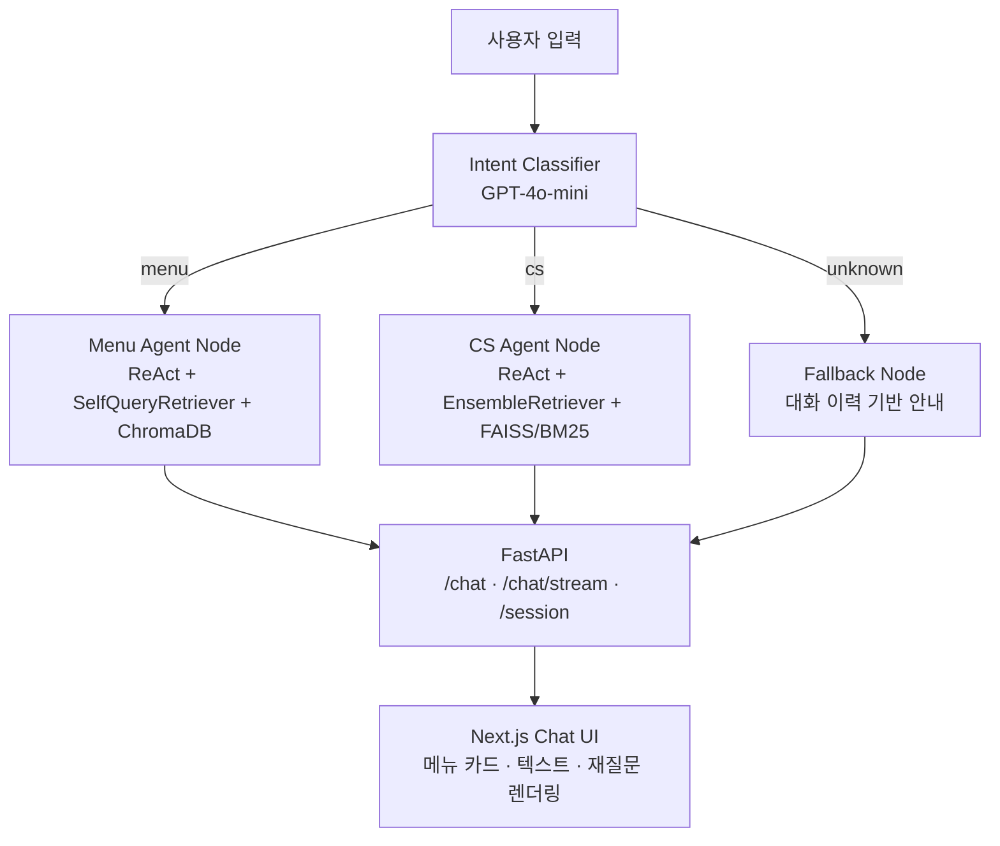

# Implementation Plan — readme-mermaid-arch

## Change
`README.md` 라인 19~33의 ASCII 아키텍처 다이어그램을 Mermaid `graph TD`로 교체한다.

## Target File
- `README.md` (lines 19–33)

## Mermaid Diagram Design



## Validation
- README.md가 올바른 Mermaid 코드블록(```mermaid ... ```)을 포함하는지 육안 확인
- GitHub/GitLab 렌더링 확인 (push 후)

## Rollback
- git checkout README.md
